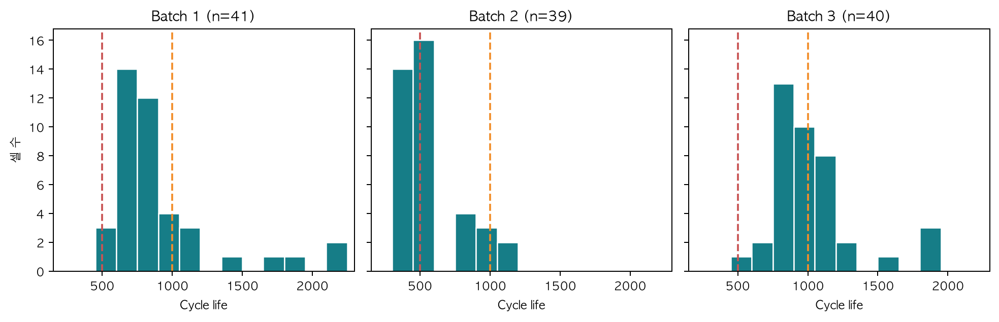
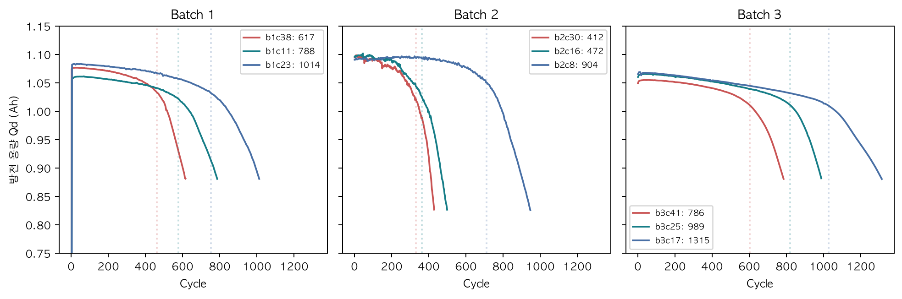
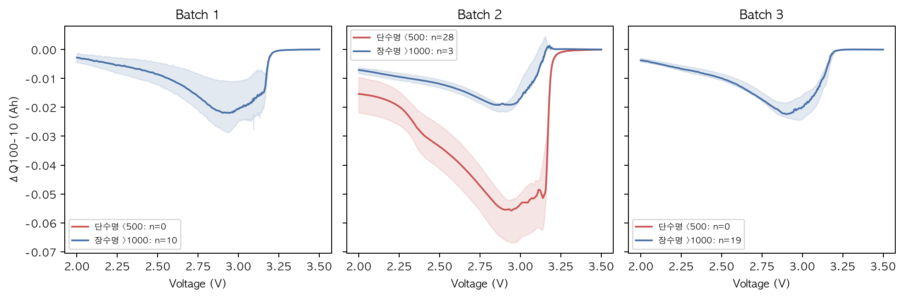
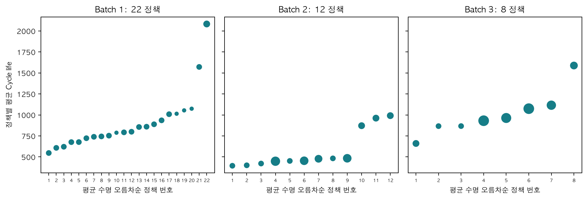
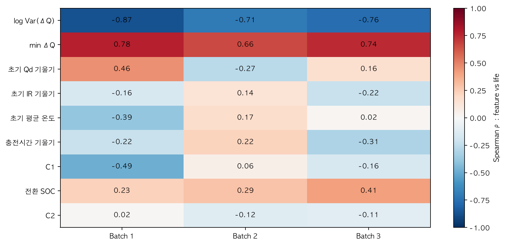
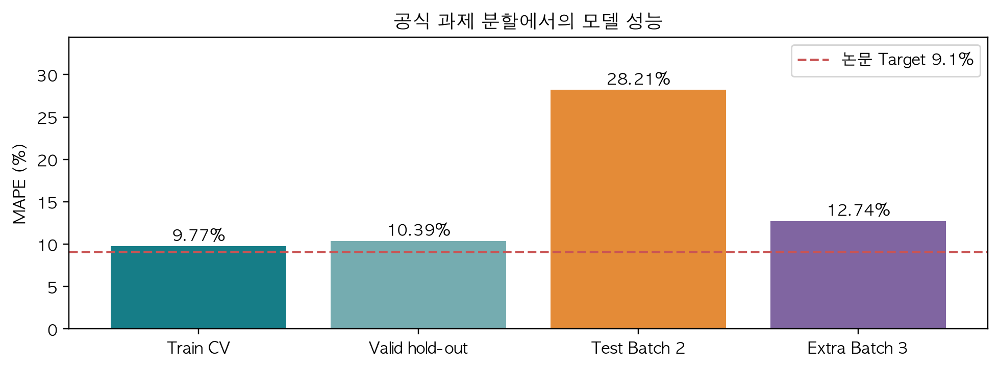
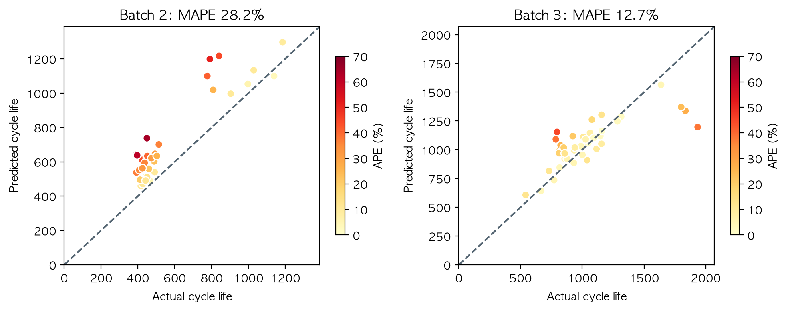
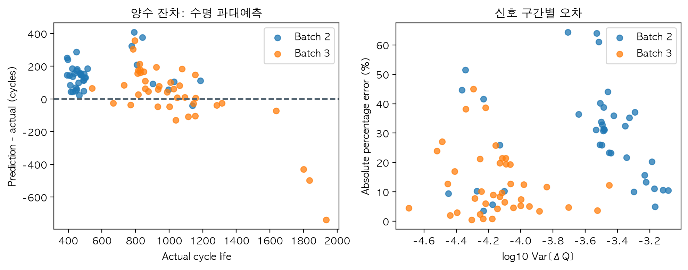

# ESS 배터리 수명 예측

초기 100사이클까지의 용량·저항·온도·충전 신호로 배터리 총 Cycle Life를 예측한다. 초기 점검과 셀 선별에 활용 가능한 신호를 찾고, 내부 검증과 외부 배치 평가의 차이를 분석하는 것이 목적이다.

## 프로젝트 개요

- 데이터셋: MIT-Stanford Battery Dataset (Severson et al., Nature Energy 2019), 수업 Kaggle mirror version1.
- 학습 데이터: Batch 1 (2017-05-12), 41셀.
- 평가 데이터: Batch 2 (2018-02-20), 39셀.
- 추가 평가 데이터: Batch 3 (2018-04-12), 40셀.
- 태스크: **Regression (Cycle Life 예측)**. 
- 최종 모델: 로그 타깃 Ridge, 입력 피처: log10 Var(ΔQ).

## 환경 설정 및 실행

Python 3.11 이상을 사용한다. 프로젝트 루트에서 다음 명령을 실행한다.

```bash
python3 -m venv .venv
source .venv/bin/activate
python -m pip install -r requirements.txt
python run_project.py --mode all
```

원자료가 없으면 `python run_project.py --download --mode all`을 실행한다(약 8GB MAT 저장 공간, Kaggle 접근 필요). DAY1만: `--mode day1`, DAY2만: `--mode day2`. `--mode day1`은 모델을 학습하지 않는다.

원자료 없이 배포된 정제 피처로 **DAY2 모델링만** 재현하려면:

```bash
python work/day2_modeling.py
python work/build_day2_report.py
python work/reporting.py
python work/verify_results.py
```

macOS는 AppleGothic을 자동 탐색한다. 다른 환경에서는 한글 TTF를 설치하고 `BATTERY_FONT_PATH`에 경로를 지정한다.

성능표는 `results/model_performance.csv`, 보고서는 `output/pdf/`에 저장된다. 데이터 출처와 정제 규칙은 `data/README.md`를 참고한다.

## EDA

### Cycle Life 분포

| 배치 | n | 중앙 수명 | 단수명 <500 | 장수명 >1000 |
|---|---|---|---|---|
| Batch 1 | 41 | 842.0 | 0 (0.0%) | 10 (24.4%) |
| Batch 2 | 39 | 472.0 | 28 (71.8%) | 3 (7.7%) |
| Batch 3 | 40 | 964.5 | 0 (0.0%) | 19 (47.5%) |

핵심 발견: Batch2에 단수명 셀이 집중된다. 전체 유효 120셀의 범위는 392~2237사이클이다. 배치 이동에 대한 평가가 필요하며 단수명 셀을 임의 이상치로 제거하지 않는다.



### 열화 곡선 분석

배치 안에서 수명 분위수 10/50/90%에 가까운 셀을 같은 축으로 비교했다. 초기10~100 대비 관측 후기25%의 Qd 기울기는 중단·재개 셀을 제외한 115셀에서 더 음의 방향이었다. 단순 직선 하나로 전체 열화를 설명하기 어렵다. 이는 기술적 조건이며 가속의 유의성 검정은 아니다.

Knee 후보는 곡선 길이20~90%에서 두 직선 SSE가 최소인 분할점으로 표시했다. 연속성·기울기 가속을 강제하지 않아 물리적 knee 확정값은 아니다. 발생 시점은 셀별로 다르며 `work/day1_design_features.csv`의 `knee_cycle_descriptive`에서 확인한다.

핵심 발견: 후기 열화 가속과 변화점이 존재하지만 미래 곡선을 쓰므로 knee와 후기 기울기는 예측 입력에서 제외한다.



### ΔQ(V) 곡선 분석

ΔQ(V)=Qd,100(V)-Qd,10(V). Batch1은 더미 배열을 고려해 인덱스100-10, Batch2·3은99-9를 사용한다. ΔQ 로그분산과 수명의 배치별 Spearman ρ: Batch 1: -0.869 / Batch 2: -0.709 / Batch 3: -0.759.

핵심 발견: Batch2 단수명 곡선은 장수명보다 음의 골이 깊다. 세 배치 모두 로그분산-수명 관계는 음의 방향이다. Batch1·3에는 <500 셀이 없어 그 배치 내 절대 장단수명 비교는 불가능하다.



### 충전 속도(C-rate)와 수명의 관계

C1·전환SOC·C2의 전체 정책 문자열별로 평균 수명과 표본 수를 계산했다. 정책별 평균 범위: Batch 1: 546.5~2083.0 cycles (22정책) / Batch 2: 394.5~991.3 cycles (12정책) / Batch 3: 660.0~1588.2 cycles (8정책). 상세 평균은 `work/day1_policy_mean.csv` 및 DAY1 PDF 부록에 있다. n=1 정책의 평균은 단일 셀 결과다.

| 배치 | C1-수명 ρ | 충전전류-후기 Qd 기울기 ρ |
|---|---|---|
| Batch 1 | -0.489 | -0.510 |
| Batch 2 | 0.055 | 0.103 |
| Batch 3 | -0.163 | 0.067 |

실제 전류 요약은 cycle10·50·100의 I>0.1A 충전 샘플 평균을 다시 평균했다. 시간가중 평균이 아니며, 후기 Qd 기울기가 더 음수일수록 감소가 빠르다.

핵심 발견: C-rate·수명 관계는 배치마다 다르고 정책과 배치가 얽혀 있다. 빠른 충전이 무조건 짧은 수명의 원인이라는 인과 결론은 낼 수 없다.



### 초기 피처 상관과 중복

배치별 피처-수명 순위상관, 피처 간 상관과 VIF를 확인했다. ΔQ 로그분산·최솟값은 중복이 크며 정책 변수도 공선성이 있다. 표준화는 다중공선성을 해결하지 않는다. `work/day1_vif.csv`에 전체 진단을 기록했다.

분포 동일성의 보조 검정은 Kruskal-Wallis H=48.824, p=2.5e-11였다. 귀무가설은 세 배치의 분포 동일성이다. 셀 독립성을 가정하며, 군집 의존성·분포 모양 차이 때문에 단순 중앙값 또는 인과 효과 검정으로 해석하지 않는다.



## Modeling

### 피처 엔지니어링 전략

- D1: log10 Var(ΔQ). 전압별 초기 변화의 산포를 요약하고 작은 양수의 스케일을 안정화한다.
- D2: D1+min(ΔQ). 가장 큰 음의 변화를 추가하되 중복과 추가 기여를 검증한다.
- State: D1+초기 Qd·IR 기울기+평균온도+충전시간 기울기. 용량·저항·열·충전 변화의 추가 기여를 본다.
- Full: State+C1·전환SOC. 충전조건 추가 효과를 본다. C2는 DAY1 탐색에서 검토했으나 복잡도·정책 의존성을 줄이기 위해 실제 비교 묶음에 추가하지 않았다. 이 제외 선택의 우월성을 별도로 입증한 것은 아니다.
- 총 관측 길이, knee, 후기 기울기, 셀ID·배치ID는 입력에서 제외한다. 모든 입력은100사이클 이내 정보다.

| 피처 묶음 | ElasticNet CV MAPE (%) |
|---|---|
| D1 | 9.77 |
| D2 | 10.74 |
| State | 10.72 |
| Full | 11.44 |

추가 피처의 검증상 일관된 이득이 없어서 최종 D1을 사용했다. 선택 피처가 하나여서 피처 간 다중공선성은 없고 VIF=1이다. 이는 셀 간 통계적 독립성을 보장하지 않는다.

### 모델 선택 및 근거

- 후보: Ridge·ElasticNet·RBF SVR ×4피처 묶음 + Full Random Forest·Gradient Boosting, 총14조합.
- 최종: 로그 타깃 Ridge / D1.
- 선택 기준: Development nested group CV 평균 MAPE 최소. 최소값 대비0.01%p 이내의 Ridge D1은 동률로 보고 단순성을 우선한다. 외부 점수는 선택에 사용하지 않는다.
- Ridge D1과 ElasticNet D1은 약9.77%로 사실상 동률이며 단일 피처에서는 L1 선택의 이득이 없어 Ridge를 선택했다.
- 파라미터: Ridge alpha ∈[0.01,0.1,1,10,100]. Development 선택=0.1, Batch1 전체 재학습=1. alpha는 L2 계수 축소 강도다.
- 나머지 탐색 범위는 `work/day2_modeling.py`의 `factory`, 선택값·후보 오차는 `work/day2/candidate_comparison.csv`에 있다.

Batch1을 충전정책 그룹 기준 development 30셀/16정책, hold-out 11셀/6정책으로 고정 분리(seed42)했다. 정책 중복은0이다. 개발 자료에서 바깥4분할 GroupKFold는 후보 비교, 안쪽3분할은 튜닝을 수행한다. `Pipeline` 중앙값 결측 대치·표준화는 훈련 폴드 내부에서만 적합한다. `TransformedTargetRegressor`로 로그 타깃을 처리하고 exp 역변환 후 **원 수명 단위 MAPE**로 튜닝한다.

확정한 모델·피처를 Batch1 전체로 재튜닝/학습 후 Batch2·3에 적용한다. 원 타깃은 같은 모델 묶음의 민감도 분석으로만 비교했다(hold-out MAPE 11.19% vs 로그 10.39%). 홀드아웃의 이 비교로 최종 후보를 재선정하지 않았다.

## 성능 결과

| 구분 | MAPE (%) / Gap (%p) | 비고 |
|---|---|---|
| Train (Batch 1 CV) | 9.77 | Development 30셀, nested group CV 4-fold 평균 |
| Valid (Batch 1 Hold-out) | 10.39 | 정책 분리 11셀 |
| Test (Batch 2) | 28.21 | Batch1 전체 학습 후 39셀 |
| Gap (Train-Valid) | +0.62 | Valid - Train |
| Gap (Valid-Test) | +17.82 | Test(Batch2) - Valid |
| Gap (Target-Test) | +19.11 | Test(Batch2) - 논문 참고 목표 9.1 |
| Test (Batch 3) | 12.74 | 추가 40셀 |
| Gap (Batch2-Batch3) | -15.47 | Test(Batch3) - Test(Batch2) |
| Gap (Target-Test, Batch 3) | +3.64 | Test(Batch3) - 9.1 (공통 참고값; Batch3 전용 논문 기준 아님) |

MAPE는 백분율, Gap은 퍼센트포인트(%p)다. 행 이름은 안내를 따르고 부호는 **나중 오차-앞 오차**로 정의했다. 양수는 오차 증가, 음수는 감소다. Batch3 전용 논문 목표가 안내에 없어9.1%는 공통 참고값으로만 표시했으며 공식 Batch3 성능 재현이라고 주장하지 않는다.

Batch2 중앙값 기준 모델 MAPE=69.83%, 최종 MAE=147.21, RMSE=171.71cycles, R²=0.387. 고정 모델의 셀 bootstrap MAPE95% CI=23.25~33.38% (Batch2), 9.41~16.21% (Batch3). 5000회 재표본이며 모델 재학습·미래 배치 불확실성은 포함하지 않는다. 정책 군집 의존성으로 낙관적일 수 있다.

Train은 훈련셋 맞춤 오차가 아니라 CV 평균이다. Valid는30셀 학습, Test는41셀 재학습이므로 Gap을 순수 배치 효과로만 볼 수 없다. 후보 선택에는 낙관성이 있을 수 있어hold-out을 별도 보고한다. 구버전 파일럿과 DAY1 탐색에서 외부 배치를 이미 봤으므로 완전 눈가림 테스트는 아니다. DAY2 외부 오차로 재선정·사후 보정하지 않았다.



## 오류 분석

| 셀 | 배치 | 실제 수명 | 예측 수명 | APE (%) |
|---|---|---|---|---|
| b2c18 | Batch 2 | 449 | 737.6 | 64.3 |
| b2c6 | Batch 2 | 393 | 644.5 | 64.0 |
| b2c15 | Batch 2 | 396 | 637.7 | 61.0 |
| b2c9 | Batch 2 | 791 | 1198.6 | 51.5 |
| b3c40 | Batch 3 | 796 | 1154.4 | 45.0 |
| b2c44 | Batch 2 | 841 | 1217.1 | 44.7 |

Batch2 39셀 중 38셀은 과대예측했다. 단수명 28셀의 MAPE=29.81%, 평균 과대예측=132.1cycles다. 큰 오류는 주로Batch2이고 짧은 수명을 과대예측하는 방향이다. Batch1에는<500 학습 셀이 없어 해당 영역 대표성이 부족하다.

원인 가설은 ΔQ 범위 이동·같은 신호에서 수명 수준 이동·정책/제조 배치 차이다. Batch3 MAPE가Batch2보다 15.47%p 낮다고 모든 새 배치에 일반화됐다는 뜻은 아니다. ΔQ 관계가 유사해도 정책·온도·숨은조건은 다를 수 있고, EDA와 현재 모델만으로 원인을 확정할 수 없다.

개선 방향: 단수명 표본과 새 배치를 확보하고 독립 보정용/최종 평가용 자료를 분리한다. 피처 추가·배치 적응은새 데이터에서 검증한다. Ridge Full은 다변량 그룹 외삽과 exp 역변환으로오차가 폭증한 실패 후보도 CSV에 보존했다.




## ESS 도메인 해석

동일 chemistry·측정조건의 셀 선별, 추가 점검 우선순위 설정에 사용할 조기 진단 보조지표다. 총Cycle Life와100사이클 시점RUL은 구분한다(RUL=예측 총수명-100). 과대예측은 교체를 늦추는 위험이 있어 이 모델만으로 BMS 보호·교체 기준을 자동화하지 않는다.

실배포에는 현장 온도·SOC창·부하·calendar aging·셀→모듈→팩 차이를 반영한 독립 검증, 편향 보정, 예측구간 coverage 검증이 필요하다. 시간 수명으로 환산하려면 사이클 빈도·달력 열화를 별도로 모델링해야 한다.

## 논문 성능 비교

Batch2는 과제 참고목표9.1%에 미달했다(Gap +19.11%p). 공식 논문 로더의 Batch2는2017-06-30이고 수업mirror는2018-02-20이므로 표본·분할 조건이 같은 직접 재현 비교는 아니다.

## 참고문헌

- Severson et al. (2019). Data-driven prediction of battery cycle life before capacity degradation. *Nature Energy*, 4, 383–391. [DOI](https://doi.org/10.1038/s41560-019-0356-8)
- [공식 데이터](https://data.matr.io/1/), [공식 로더·코드](https://github.com/rdbraatz/data-driven-prediction-of-battery-cycle-life-before-capacity-degradation)
- [수업 Kaggle 데이터](https://www.kaggle.com/datasets/itshpark/data-driven-prediction-of-battery-cycle)
- 원자료 이용·재배포는 원출처 조건을 따른다.

## 작성자

이효준 · 울산3반: EDA, 피처 엔지니어링, 모델 개발·평가·보고서 작성.

